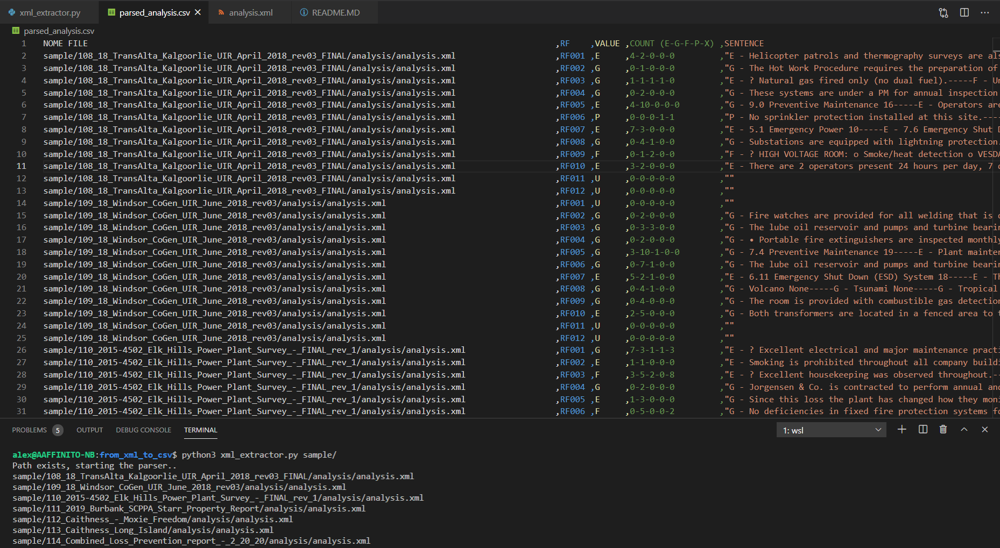

# README
Select and aggregate XML tags, from multiple XMLs in a directory tree, to extract them in a CSV file

- Check for void files
- Take as a parameter the directory to explore
- The directory is a required parameter and the folder existence is checked at start
- A unique CSV file is generated with the result pf the parsing of all the  “analysis.xml” found
- Sentences are re-written between double quotes to prevent line breaking from commas “,”
- a separator "----" is added if more than one sentence is found `<sentences><s><text> `
- `riskFactorValue` is concatenated for every sentence
  

